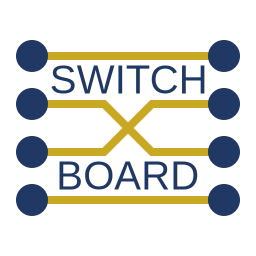

# Switchboard

A library for FTC providing powerful scheduling solutions for software and hardware.

## Features
 - Command-based model
 - Command scheduling using directed acyclic graphs
 - Kotlin domain specific language for complex command definition
 - Kotlin suspending functions as cooperatively scheduled commands
 - Hardware wrappers and stubs for common devices
 - Configuration manager that handles multiple tags in device names and automatically stubs missing devices
 - Composable schedulers for hardware devices

And more...

Some more comprehensive documentation is still in progress, for now check out this [presentation](https://docs.google.com/presentation/d/19RBNY5aCJK8FEnOWX4JIMRd9WVtqkeJ7pX1d8rqK2_U/edit?usp=sharing).